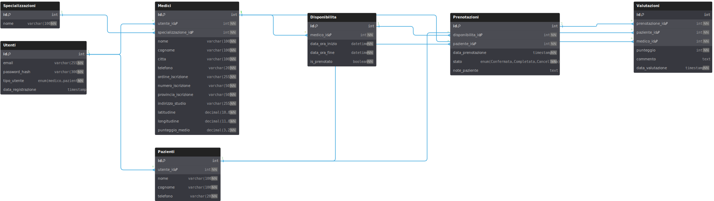

# Assistente Virtuale AI per l'Orientamento Sanitario

## Descrizione del Progetto
Questo progetto di tesi presenta lo sviluppo di una piattaforma web completa: un **Assistente Virtuale AI per l'Orientamento Sanitario**. L'obiettivo principale è fornire agli utenti uno strumento intelligente per l'analisi preliminare dei sintomi, indirizzandoli verso lo specialista medico più appropriato. La piattaforma integra un motore di ricerca geolocalizzato per trovare professionisti sanitari, un sistema di prenotazione delle visite e un meccanismo di valutazione basato sul feedback dei pazienti.

## Tecnologie Utilizzate
La piattaforma è costruita su un'architettura a microservizi containerizzata, sfruttando le seguenti tecnologie:

* **Backend:** Python 3.10, FastAPI, MariaDB
* **Intelligenza Artificiale:**
    * **Modello LLM:** Ollama con `Qwen2.5`
    * **Orchestrazione Agenti AI:** LangGraph
    * **Strumenti RAG:** LangChain
    * **Vector Store:** FAISS per la ricerca semantica
* **Frontend:** HTML5, CSS3, JavaScript ES6+ (con FastAPI per il rendering dei template)
* **Containerizzazione:** Docker e Docker Compose (con supporto GPU opzionale)
* **Database:** MariaDB

## Panoramica delle Funzionalità

### Backend
Il backend, costruito con **FastAPI**, espone un set completo di API RESTful per gestire la logica di business dell'applicazione.

* **Gestione Utenti e Autenticazione:** API per la registrazione e il login sicuro di medici e pazienti.
* **Sistema di Prenotazione e Disponibilità:**
    * I medici possono definire e gestire i propri slot di disponibilità.
    * I pazienti possono cercare e prenotare le visite, con aggiornamenti di stato (Confermata, Completata, Cancellata).
* **Sistema di Valutazione:** I pazienti possono lasciare recensioni e punteggi per le visite completate, contribuendo a un punteggio medio per ogni medico.
* **Ricerca Geolocalizzata:** API per trovare medici nelle vicinanze, applicando filtri per specializzazione, città e date disponibili.
* **Integrazione AI:** Un agente conversazionale avanzato, orchestrato da **LangGraph**, analizza i sintomi degli utenti e, tramite un sistema **RAG (Retrieval-Augmented Generation)**, suggerisce lo specialista più idoneo.

### Frontend
Il frontend è un'applicazione web dinamica che offre un'interfaccia utente intuitiva e funzionale.

* **Autenticazione Utente:** Pagine dedicate per il login e la registrazione di nuovi account.
* **Ricerca Medici:** Un'interfaccia di ricerca avanzata con filtri e una mappa interattiva per visualizzare i medici su base geografica.
* **Chat con AI:** Un'interfaccia di chat per interagire con l'assistente virtuale, ricevere suggerimenti sullo specialista e avviare il processo di prenotazione.
* **Dashboard Utente:** Aree riservate per medici e pazienti dove è possibile gestire il proprio profilo, le prenotazioni, le disponibilità e le recensioni.

## Struttura del Database
La piattaforma utilizza un database relazionale **MariaDB**, progettato per garantire consistenza e integrità dei dati.

* **Schema Strutturale:** La struttura include tabelle per la gestione di utenti, profili (medici e pazienti), specializzazioni, disponibilità, prenotazioni e valutazioni. Le relazioni assicurano la coerenza tra le entità.

    

* **Script di Inizializzazione (`init.sql`):** Questo script SQL si occupa di:
    * Creare il database e l'utente con i permessi necessari.
    * Definire la struttura di tutte le tabelle, inclusi indici e chiavi esterne.
    * Inserire i dati iniziali, come le specializzazioni mediche.
    * Impostare `TRIGGER` per l'aggiornamento automatico del punteggio medio dei medici.
    * Configurare `EVENTI` schedulati per la pulizia periodica dei dati obsoleti.

* **Script di Seeding (`seeder.py`):** Per facilitare i test e lo sviluppo, è stato creato uno script Python che popola il database con un'ampia quantità di dati fittizi ma realistici, tra cui:
    * Utenti medici e pazienti generati casualmente.
    * Medici di test con coordinate geografiche reali per simulare scenari di ricerca geolocalizzata.
    * Disponibilità, prenotazioni e valutazioni generate in modo coerente.

## Funzionalità di Sicurezza
La sicurezza dell'applicazione è stata gestita attraverso l'implementazione di diverse misure:

* **Hashing delle Password:** Le password degli utenti non sono mai memorizzate in chiaro. Viene utilizzato l'algoritmo **bcrypt** (`passlib`) per generare un hash sicuro, resistente agli attacchi di forza bruta.
* **Autenticazione con JWT:** L'accesso alle API protette è gestito tramite **JSON Web Tokens (JWT)**. Dopo un login corretto, il client riceve un token con una scadenza limitata, che deve essere incluso in ogni richiesta successiva come Bearer Token.
* **Prevenzione XSS (Cross-Site Scripting):** Tutti i dati generati dagli utenti e visualizzati nel frontend vengono sottoposti a sanitizzazione. L'output HTML dinamico viene trattato per codificare i caratteri speciali, impedendo l'iniezione di script dannosi.
* **Validazione dell'Input:** Sia lato frontend che backend, l'input dell'utente viene validato per garantire che i dati siano nel formato corretto prima di essere elaborati o salvati.

## Modello AI e Librerie
L'intelligenza artificiale è il nucleo dell'esperienza utente per l'orientamento sanitario.

* **Modello:** Viene utilizzato **Qwen2.5**, un modello linguistico di grandi dimensioni (LLM) eseguito localmente tramite **Ollama**, che riduce la dipendenza da servizi cloud esterni.
* **LangGraph:** L'interazione con l'AI è gestita da un'architettura ad agenti basata su `LangGraph`. Questo permette di definire flussi conversazionali complessi in cui l'agente può decidere autonomamente se rispondere direttamente o utilizzare strumenti esterni (come la ricerca di specialisti).
* **LangChain e FAISS:** Per fornire raccomandazioni accurate, è stato implementato un sistema **RAG**. `LangChain` viene utilizzato per orchestrare il recupero di informazioni da una base di conoscenza di specializzazioni mediche, indicizzata in un vector store **FAISS** per una ricerca semantica efficiente.

## Contatti
- [tremorz3] - [Giovanni] - [pinto.2046796@studenti.uniroma1.it]
- [raaiss] - [Raimondo] - [massari.2067064@studenti.uniroma1.it]
